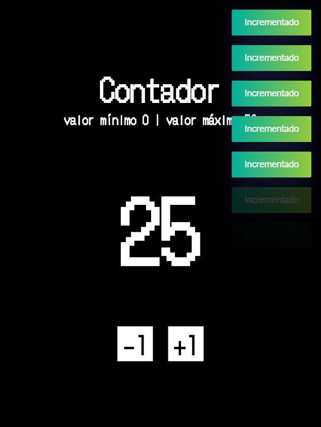
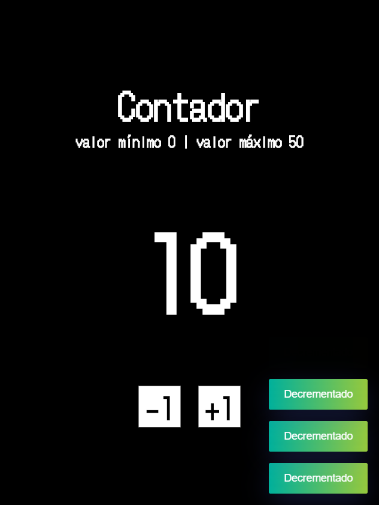
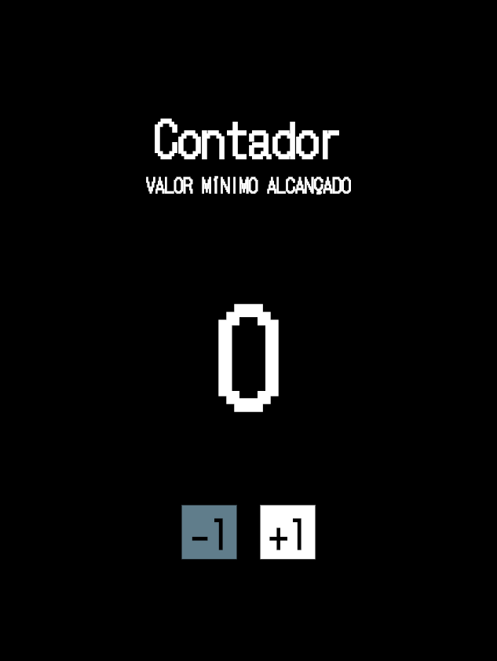

# 🧮 Contador App Flutter

Aplicação Mobile em Flutter, feita como uma forma de revisão aos conceitos mais básicos do desenvolvimento de aplicações com este framework.

## ⚙️ Informações adicionais

- Flutter: v. 2.5.1
- Dart: v. 2.14.2
- Flutter Toast: v. 8.0.9
- Fonte: DotGothic16

## 🖼️ Imagens

  
  

  
  

